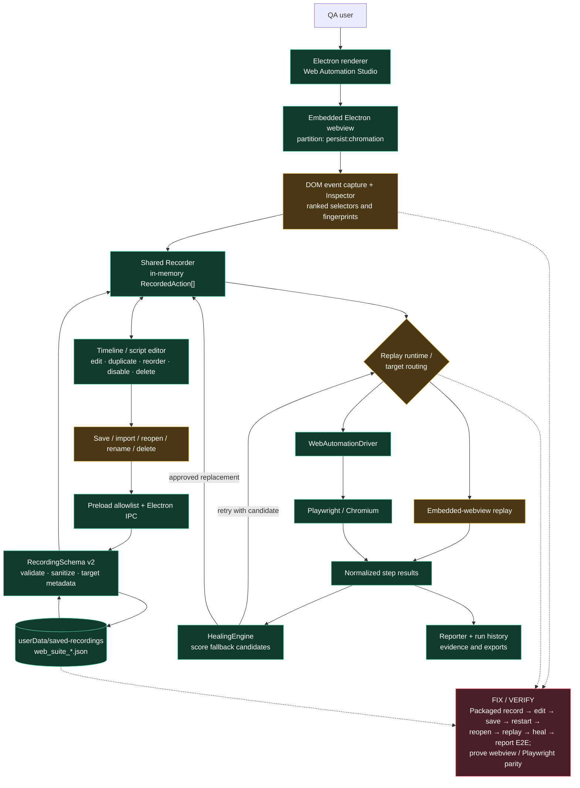
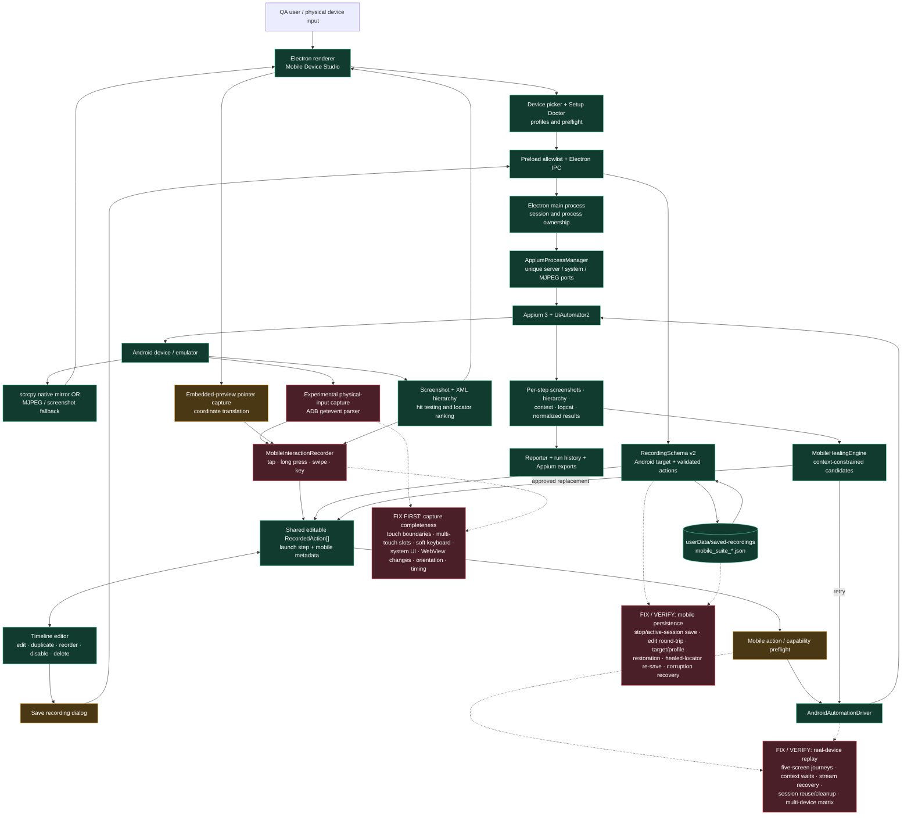

# OmniFlow QA

OmniFlow QA is an Electron desktop QA workspace for web and Android automation.
It brings browsing, inspection, recording, replay, locator healing, suites,
reporting, and export into one developer-focused application.

> Current status: `0.3.0-beta.2`. See the comprehensive
> [Current Product and Engineering State](docs/CURRENT_STATE.md) for verified Web
> Automation, Mobile Automation, UI/UX, limitations, and next work.

## Current workflow

`Browse or connect a device -> inspect -> record -> edit -> save -> replay -> heal -> report -> export`

## Current automation architecture

These diagrams describe the implementation as it works now. Green nodes are
established paths, amber nodes need hardening, and red nodes are the first places
to investigate when a recorded journey cannot be saved or replayed faithfully.

### Web automation



Web repair order: first add a packaged Electron fixture journey around the three
amber boundaries (capture, persistence round-trip, and runtime routing). A saved
recording is the validated JSON document, not the editor's live in-memory array;
replay after restart must therefore load through `RecordingSchema` and restore
the recording target before choosing webview or Playwright. Persisting an
approved healed locator also changes the Recorder state, so it must be saved
again if that repair is expected to survive restart.

### Mobile automation (Android, current state)



Mobile repair order is capture completeness first, persistence second, and
replay certification third. Editing and JSON saving already share the web
recording schema, but they cannot recover actions that physical capture never
created. Use a repeatable five-screen native/hybrid fixture and compare device
events, the live timeline, the reopened JSON recording, and replay results step
for step. Do not treat a successful file write or Appium session as proof that
mobile recording works end to end. iOS is not implemented.

#### Replay routing safeguards now implemented

- Web and mobile drafts remain in separate workspace timelines and cross-target
  saves are rejected instead of silently mixing steps.
- Saved and recent recordings display a `Web` or `Android / Appium` identity.
- Schema migration detects legacy mobile actions even when target metadata is
  absent or incorrectly says `web`, preventing accidental browser replay.
- Loading a mobile recording restores its application, activity, device serial,
  automation name, and local Appium endpoint when those values were saved.
- Android replay is blocked until the application identity, ADB, Appium, and an
  authorized matching device are available, then asks for explicit confirmation
  before Appium controls the device. iOS recordings are identified and rejected
  with an implementation-status message.

These safeguards fix target selection and replay preparation. They do not change
the experimental status of physical mobile interaction capture described above.

Mobile authoring now asks the user to choose among the hierarchy identifiers for
each captured tap or long press. Accessibility IDs and resource IDs are ranked
first, while confidence, ranking reasons, XPath alternatives, and the coordinate
fallback remain visible. Coordinate capture requires explicit confirmation when
no identifier exists and is labeled as a low-confidence, layout-dependent step.
Setup Doctor expands failed checks and provides copyable Appium 3 and
UiAutomator2 installation commands in dependency order.

### Web

- Embedded webview and Playwright replay paths.
- Ranked inspection locators and conservative healing.
- Editable recordings, assertions, waits, variables, environments, and flows.
- Suites, browser matrices, concurrency, reports, and CI-oriented exports.
- Playwright, Selenium, Cypress, Puppeteer, and CDP script export.

### Android

- Appium 3 and UiAutomator2 for native, hybrid, and mobile-web targets.
- Connected-device picker for USB, emulator, and network targets.
- Screenshot/hierarchy inspector, stable mobile locators, gestures, lifecycle,
  contexts, permissions, alerts, files, key actions, and evidence.
- Managed local Appium processes with collision-free per-device ports.
- Native scrcpy mirror/control with MJPEG and screenshot fallbacks.
- Appium TypeScript, Java, and Python export.

iOS is not implemented.

## UI/UX

- Premium dark/light Electron shell with custom window controls.
- Compact collapsible navigation, command palette, KPI dashboard, recording table,
  responsive side drawers, status pills, focus states, and reduced-motion support.
- Progressive disclosure keeps advanced mobile and matrix settings out of the
  primary workflow.

## Install and verify

Windows end users can install the application with the single
`OmniFlow-QA-Setup.exe` file produced in `release`. Electron, Chromium, and the
application's Node.js packages are bundled, so Node.js and npm are not required
on the end-user machine. See the [Windows installation guide](docs/INSTALL_WINDOWS.md)
for optional Android automation prerequisites and official download links.

Requirements: Node.js 20 or 22 and npm 10.

```powershell
npm install
npm.cmd run check
npm.cmd start
```

The current deterministic gate passes 35 Jest suites and 183 tests, ESLint,
TypeScript, and Webpack. Android execution additionally requires ADB, Java,
Appium, UiAutomator2, and an authorized device or emulator. The in-app Setup
Doctor reports missing dependencies.

## Documentation

- [Documentation index](docs/README.md)
- [Windows installation guide](docs/INSTALL_WINDOWS.md)
- [Current state](docs/CURRENT_STATE.md)
- [Mission delivery program](docs/MISSION_DELIVERY.md)
- [Suites and workflows](docs/SUITES_AND_WORKFLOWS.md)
- [Android compatibility](docs/ANDROID_COMPATIBILITY_MATRIX.md)
- [Plugin SDK](docs/PLUGIN_SDK.md)

## License

MIT
